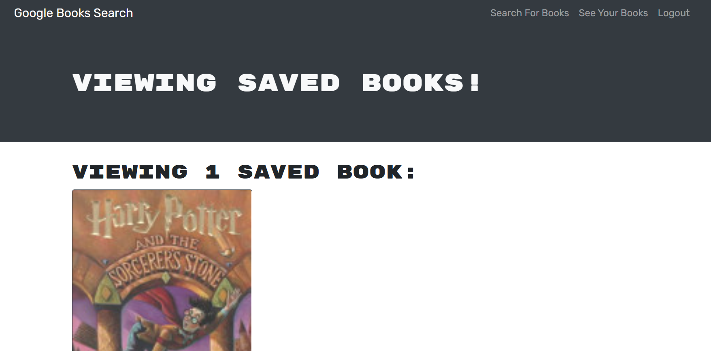

# booksearchengine

## Description

---

The Book Search Engine is a Google Books API search engine that has been refactored to be built with a GraphQL API with Apollo Server. It is a web application that was built using the MERN stack, with a React front-end, MongoDB database, and Node.js/Express.js server and API. An Apollo Server was set up and a series of queries and mutations were created and tested to both fetch and modify data. This search engine allows users the ability to sign up, log in, search for books, save book searches to the back end, and delete saved books. For further information on this app, please visit my GitHub repository [here](https://github.com/caitoreilly/booksearchengine.git) and my deployed application [here](https://rocky-tor-48539.herokuapp.com/).

## Screenshot

---

This image displays the "See Your Books" page of a logged in user.

.

## Questions

---

If you have any questions about this project, please feel free to contact me directly via email at coreilly29@gmail.com.
